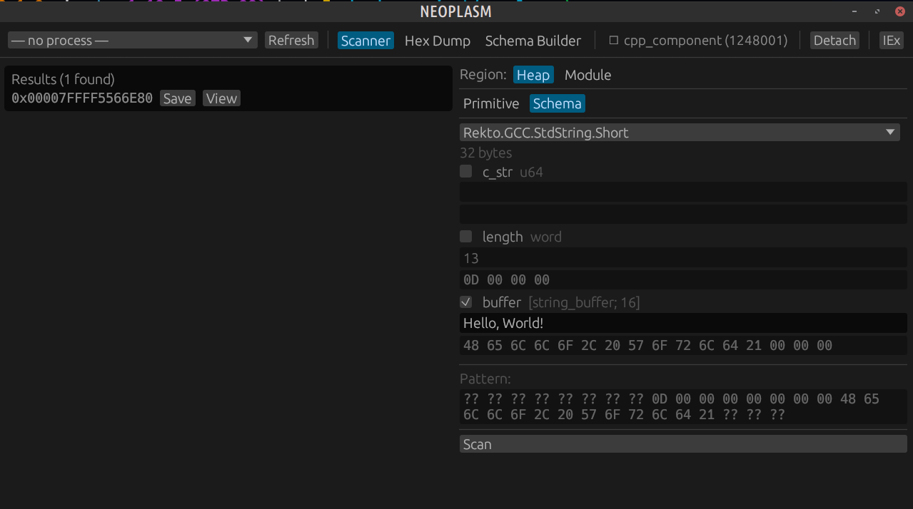
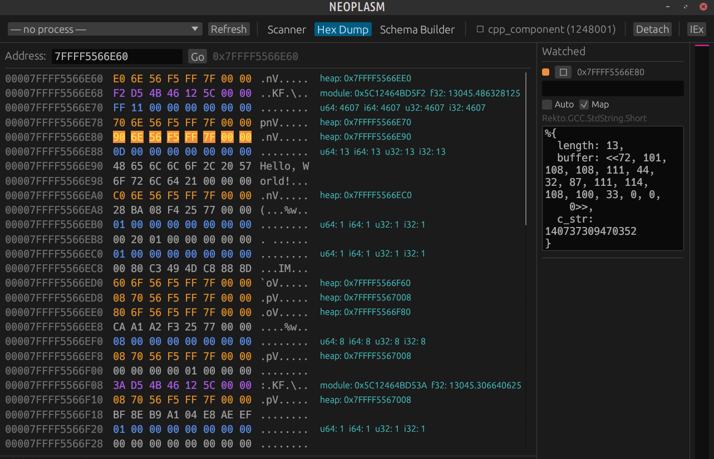

# Krebs Project

> **[Krebs](https://en.wiktionary.org/wiki/Krebs#German):** /kʁeːps/ *m* (*genitive* Krebses, *plural* Krebse)
>
> 1. **crab**
> 2. **cancer (disease)**

A memory query engine, in the literal sense: it treats another process's live memory as a
typed, queryable database. Attach to a running program, declare a C++ struct as a schema
(fields, constraints, pointers-as-foreign-keys), and query it the way you'd query a table —
scanning, deserializing, and validating in one step, across Windows and Linux, 32- and
64-bit, MSVC/GCC/LLVM ABIs. Written in Rust (the memory/scanning core) and Elixir (the
schema DSL, GUI, and MCP server), because it turns out those two languages complement each
other unusually well: Rust's ownership model keeps unsafe memory operations from ever
corrupting the BEAM, and Elixir's hot-reloading turns reverse-engineering into a REPL
conversation instead of a compile-edit-restart loop.

The name was originally chosen for self-deprecatory purposes, but it turns out to be quite
fitting beyond that:

- The [Rust mascot](https://www.rustacean.net/) is a crab
- _Like a crab_, this project **moves sideways**, tackling problems with bizarre lateral moves
- _Like a cancer_, it **attaches to bigger things and subverts them**
- _Like a cancer_, it **trades power and complexity for resilience**
- _Like a cancer_, it **was dormant for years**

**Primary Languages:** Rust, Elixir · **Secondary Languages:** C++

**Jump to:** [Libkrebs](#libkrebs) · [Rekto](#rekto) · [Krebs](#krebs) · [Neoplasm](#neoplasm)
· [Getting started](#getting-started) · [Origin story](#how-did-things-end-up-like-this) · [What's interesting here](#what-did-you-find-interesting-about-this-project)

---

# Getting started

## Prerequisites

- **Rust nightly** — the workspace uses `#![feature(portable_simd)]` and
  `#![feature(associated_type_defaults)]`. A `rust-toolchain.toml` at the repo root pins
  this automatically (Cargo picks up nightly for any command run inside the tree,
  including the NIF crates under `krebs/` and `neoplasm/`, which are outside the Cargo
  workspace but still under this override) — install it once with
  `rustup toolchain install nightly`, then just run plain `cargo`.
- **Elixir 1.18+ / OTP 26+** (developed against Elixir 1.19 / OTP 28) for `rekto`, `krebs`,
  and `neoplasm`.
- **A C toolchain** (`gcc`/`g++`, `make`) — needed to build `libkrebs`'s NIF crates (via
  `rustler`) and the C++ fixture used by the `cpp_scan` example.
- **Linux only — `ptrace_scope`:** reading another process's memory through
  `/proc/{pid}/mem` goes through the same permission check as `PTRACE_ATTACH`. Ubuntu/Debian
  (and most distros) ship the Yama LSM with `kernel.yama.ptrace_scope` set to `1`, which
  restricts ptrace to a process's own children — so attaching to an arbitrary running PID
  (anything not spawned by libkrebs itself, e.g. via `krebs.attach` or the MCP `attach`
  tool) fails with a permission error unless you run as root or relax this. Check the
  current value:

  ```bash
  cat /proc/sys/kernel/yama/ptrace_scope
  ```

  Set it to `0` (any process may ptrace any other process owned by the same user) for the
  current boot:

  ```bash
  sudo sysctl kernel.yama.ptrace_scope=0
  # or: echo 0 | sudo tee /proc/sys/kernel/yama/ptrace_scope
  ```

  To persist across reboots:

  ```bash
  echo 'kernel.yama.ptrace_scope=0' | sudo tee /etc/sysctl.d/10-ptrace-scope.conf
  ```

  This is the same relaxation any local debugger (`gdb`, `strace`) needs — know what you're
  opting into system-wide before flipping it. Windows has no equivalent knob: the Win32
  backend just needs to be run with sufficient privilege (elevated, or same-user/same-
  integrity-level) to open a process handle with the access rights it requests.

## Building each piece

```bash
# Rust core — libkrebs, its tests, and its examples
cargo check --workspace
cargo test --workspace -- --skip word_pattern   # one pre-existing UB crash, see below

# rekto — the schema DSL, no native deps
cd rekto && mix deps.get && mix compile

# krebs — Elixir bindings + MCP server (builds the libkrebs_nif Rust NIF via rustler)
cd krebs && mix deps.get && mix compile

# neoplasm — desktop GUI (builds the neoplasm_nif egui NIF via rustler)
cd neoplasm && mix deps.get && mix compile
```

## Running it

```bash
# Attach to a running process and get an MCP server + iex session on it
cd krebs
iex -S mix krebs.attach --name SomeGame   # or --pid 1234
# MCP server now listens on http://localhost:4040 (override with `config :krebs, :mcp_port, N`)

# Open the GUI (also starts its own MCP server + krebs/rekto stack, as path deps)
cd neoplasm
iex -S mix

# Run the self-contained C++ integration test — builds and spawns its own fixture,
# no attach/ptrace_scope wrangling needed against an external process
cd libkrebs
cargo run --example cpp_scan

# Run the AssaultCube demo against a live game
cargo run --example assault_cube [PID]
```

Known pre-existing test issues (not regressions, safe to ignore): the `word_pattern` test
module has an unrelated UB crash (skip it as shown above), and one GCC-string test has a
pending `todo!()`.

---

# Libkrebs

**Language: Rust**

The core engine. Three things live here:

- A cross-platform process handle (Win32 API on Windows, `/proc/{pid}/mem` on Linux) for
  reading/writing another process's memory and enumerating its regions and modules
- Byte-based *scan patterns* — plain, word-aligned, or SIMD-accelerated — for finding a
  value (or a struct shape) inside a raw memory buffer
- Rust representations of MSVC/GCC/LLVM `std::string`/`std::vector` layouts, so STL
  internals can be turned into scan patterns instead of hand-decoded byte-by-byte

```rust
// A scan pattern is a byte vector, optionally with a wildcard mask.
let pattern: BytePattern = scan_pattern!(vec![0x01, 0x02, 0x03, 0x04]);

let buf: [u8; 0xC] = [
    0xFF, 0x00, 0xFF, 0xFF,
    0x01, 0x02, 0x03, 0x04,
    0xFF, 0xFF, 0xFF, 0xFF,
];

assert_eq!(pattern.scan_buffer(&buf[..]).len(), 4);
```

The `Scanner` type wraps this in a `rayon`-parallel search over a live process's heap or
module memory, so the same pattern machinery works against megabytes of real process
memory:

```rust
// Attach by PID, then scan every writable region for a live std::string.
let scanner = Scanner::new(pid, 1024 * 1024)?;
let pattern: Arc<dyn ScanPattern> =
    Arc::new(Simd32Pattern::from(gcc::string::str_to_pattern("Hello, World!")));

for chunk in scanner.scan_heap(&pattern) {
    for m in chunk.matches {
        println!("{:#x}: in heap = {}", m.addr, scanner.is_in_heap(m.addr));
    }
}
```

### Benchmarks

Single-threaded scan throughput over a 50 MB buffer (`cargo +nightly bench`, this machine,
same 12-byte pattern for the last three rows — `Scanner`'s region-level parallelism, tested
separately, is on top of this):

| Pattern type    | Time/scan  | Throughput |
|-----------------|-----------:|-----------:|
| `BytePattern`   | 58.7 ms    | ~850 MB/s  |
| `WordPattern`   | 26.8 ms    | ~1.9 GB/s  |
| `Simd32Pattern` | 23.9 ms    | ~2.1 GB/s  |

SIMD gets you ~2.5x over the naive byte-by-byte scan for the same pattern, which is why
`Scanner` prefers it whenever a pattern fits in 32 bytes.

## Demo: porting a 4-year-old cheat across architectures

`assault_cube` (below) was written in 2021 against 32-bit Windows AssaultCube. In 2025 I
had Claude Code re-target it at a 64-bit Linux build over MCP, with no manual reverse
engineering:

```
❯ what's wrong with assault_krebs
● This was written for 32-bit AssaultCube on Windows. You're on 64-bit Linux — every
  offset is wrong.
● krebs - scan (health value "64 00 00 00") → 0x55E40748AE10
● Updated source: u32→u64, new LOCAL_PLAYER + HEALTH offsets
● cargo build --release → Finished
● krebs - eval → Health: 100, Armor: 0 ✓
```

Three years of platform bit-rot reversed in about ten minutes: pattern-based structure
recovery, offset recalculation, and an iterative scan → edit → compile → test loop, all
driven through the [MCP tools](#krebs) below.

## Examples

### C++ Integration Test

**Languages: Rust, C++**

`cargo +nightly run --example cpp_scan` builds a tiny C++ fixture, spawns it, scans its
live memory for a `std::string` it printed, and has the fixture itself confirm the matched
address — the smallest possible end-to-end proof that the scanner works against a real OS
process, not just an in-memory buffer. (On Windows the fixture is a separate Visual Studio
project and isn't auto-built; pass an already-running process's PID instead.)

### AssaultCube

**Language: Rust**

A read/write memory hack for [AssaultCube](https://assault.cubers.net/) — health, ammo,
position. The "Hello, World" of game hacking: AssaultCube is abandoned, has no
anti-cheat, and its data structures (player object, gun array, vtables) are simple enough
to be a clean first target, while still being complex enough to exercise pointer-chasing
and struct layout. Verified working on both 32-bit Windows and 64-bit Linux.

---

# Rekto

**Language: Elixir**

**→ Full field-type, constraint, and MCP-workflow reference: [`SCHEMAS.md`](./SCHEMAS.md)**

An [Ecto](https://github.com/elixir-ecto/ecto/)-inspired schema DSL — but instead of
mapping rows to structs, it maps *byte ranges of another process's memory* to structs.
Fields get types, constraints (`:range`, `:non_null`, `:const`, arbitrary functions),
and pointers are just fields that can be dereferenced and preloaded like a foreign key.

```elixir
defmodule MyGame.PlayerHealth do
  use Rekto.Schema

  # Sanity checks see the whole struct, not just one field — for relationships
  # a single field's constraints can't express.
  sanity :hp_not_over_max

  schema do
    field :current_hp, :f32, constraints: [range: {0.0, 1000.0}]
    field :max_hp, :f32
  end

  def hp_not_over_max(%{current_hp: hp, max_hp: max}) when hp > max,
    do: {:error, "current_hp exceeds max_hp"}

  def hp_not_over_max(%{}), do: :ok
end
```

Combined with `Krebs.Repo` (below), that schema becomes a live query against a running
process's memory:

```elixir
# Read one struct at a known address
Krebs.Repo.get(MyGame.PlayerHealth, 0x12345678)

# Or scan the whole heap for anything matching a shape
query = Rekto.Query.from(MyGame.PlayerHealth, where: [current_hp: 100])
{:ok, results} = Krebs.Repo.all(query)
```

## One step up: pointers, constraints, vtables

`PlayerHealth` has no pointers, which is most of Rekto's job. A `Weapon` that's owned by
a `Player` and starts with a validated vtable looks like this:

```elixir
defmodule MyGame.Player do
  use Rekto.Schema

  schema do
    field :health, :u32, constraints: [range: {0, 100}]
    field :name, {:string_buffer, 16}
  end
end

defmodule MyGame.Weapon do
  use Rekto.Schema

  schema do
    field :vtable, :vtable                                        # validated, in-module pointer
    field :ammo, :u32, constraints: [range: {0, 999}]
    points_to :owner, MyGame.Player, constraints: [non_null: true] # a foreign key
  end
end
```

`:owner` deserializes as an unloaded association until you ask for it — same idea as an
Ecto `belongs_to`, except "loading" means reading more bytes out of the target process:

```elixir
weapon = Krebs.Repo.get(MyGame.Weapon, weapon_addr)
%{owner: player} = Krebs.Repo.preload(weapon, :owner)
player.health
```

## A more realistic target

Toy examples like the two above still undersell it — the DSL exists for the messy stuff:
vtables, `this`-pointers, inheritance, embedded matrices, and multi-hop pointer chains.
Here's a schema shaped like the ones I actually used against a game client's object
model (a Roblox-style scene graph — every object is an `Instance`, `Part`/`Camera`/etc.
extend it, and a `CFrame` is a rotation matrix plus a position):

```elixir
defmodule MyGame.Instance do
  use Rekto.Schema

  schema do
    field :vtable, :vtable                        # non-null, in-module, memoized pointer
    field :this, :this_pointer                     # must equal this struct's own address
    points_to :name, {:string_buffer, 16}, offset: 0x28, constraints: [non_null: true]
    points_to :parent, __MODULE__, offset: 0x34    # self-referential — a linked scene graph
  end
end

defmodule MyGame.CFrame do
  use Rekto.Schema

  schema do
    field :rotation, {{:f32, 3}, 3}   # 3x3 rotation matrix, row-major
    field :position, MyGame.Vector3   # embedded struct (x/y/z :f32 fields), not a pointer
  end
end

defmodule MyGame.Camera do
  use Rekto.Schema

  # Inherits vtable/this/name/parent from Instance; new fields start after its layout,
  # with any offset gap filled in as garbage bytes automatically.
  schema extends: MyGame.Instance do
    field :cframe, MyGame.CFrame, offset: 0x60
    field :fov, :f32
  end
end
```

`Camera.__schema__()` reports the full merged, offset-checked field list — inherited and
new fields alike — which is what `Krebs.Repo` and the MCP `schema_info`/`read_type` tools
introspect to deserialize and query these structs against a live process. See
[`SCHEMAS.md`](./SCHEMAS.md) for every field type, constraint, sanity-check, and
transformation shortcut, plus the full MCP workflow for building a schema like this one
interactively against a real target.

Rekto also ships purpose-built abstractions for the C++ patterns that show up constantly
in reverse engineering — `:vtable` and `:this_pointer` field types, `points_to` for
foreign-key-style pointers, `{:string_buffer, n}` for fixed-size C strings — plus ported
MSVC/GCC `std::string` schemas, so the same query layer works regardless of which compiler
built the target binary.

---

# Krebs

**Language: Elixir** (with a Rust NIF core)

The Elixir application that ties everything together: a `Scanner` GenServer wrapping
Libkrebs, `Krebs.Repo` (the `Rekto.Repo` implementation used above), a `HexDump` inspector,
and an MCP server exposing 20+ tools — attach/detach, region and module enumeration, typed
reads, pattern scanning, iterative "next scan" sets, schema introspection, and a sandboxed
`eval` — so an AI agent (or a human over `iex`) can drive live memory analysis directly.

```
❯ there's a std::string somewhere around 0x7ffd09e0f180 — what is it?

● krebs - hex_dump (addr: "0x7ffd09e0f180", size: 32)
  0x7ffd09e0f180  90 f1 e0 09 fd 7f 00 00  0d 00 00 00 00 00 00 00  ........
  0x7ffd09e0f190  48 65 6c 6c 6f 2c 20 57  6f 72 6c 64 21 00 00 00  Hello, World!...

  The first 8 bytes are a pointer whose value is exactly this address + 0x10 — it points
  at the ASCII text sitting right after it in the same struct. A self-referential
  pointer followed by an inline buffer is libstdc++'s std::string layout (the pointer
  always exists, even for short strings, and just aims inward via the small-string
  optimization). MSVC's std::string has no leading pointer for short strings at all —
  the character buffer *is* the first field, at offset 0. So this is the GCC/Clang ABI,
  determined from the byte layout itself, not from assuming "Linux implies libstdc++."

● krebs - read_type (addr: "0x7ffd09e0f180", type: "Rekto.GCC.StdString")
  #Rekto.GCC.StdString.Short<"Hello, World!">
```

The interesting part isn't the tool calls — it's that the agent distinguished the *GCC*
struct shape from the MSVC one by reading the bytes, the same way a human reverser would,
instead of taking a shortcut from the host OS. Exposing raw `read_bytes` gets you a hex
dump; exposing typed, constrained schemas gives the agent something to actually reason
about and check its answer against.

---

# Neoplasm

**Language: Elixir, with a Rust (`egui`) NIF for the window**

A desktop GUI over the same engine, modeled visually on [Cheat Engine](https://cheatengine.org/aboutce.php): process attach,
primitive/schema scanning, a saved-address watch list, and a hex-dump inspector with
type-colored bytes and a live memory-map sidebar. All scan/query logic stays in Elixir —
the Rust NIF owns only the render loop and the GUI↔BEAM message bridge — so the GUI is a
thin client over the exact same state the MCP server and `iex` operate on. A human
watching the GUI and an AI client driving MCP can look at the same scan results at the
same time, and the GUI has an "IEx" button that drops straight into a REPL underneath it,
so point-and-click never gets in the way of the command line.




---

# How did things end up like this?

- I chose **Rust** for its performance, compile-time guarantees, and ability to safely abstract over C APIs. This was 2020: the language was trendy but its conventions and ecosystem were not all that well-established, and in the pre-LLM era you could really get into the woods.
- I started off by writing **Libkrebs**: a library for attaching to live processes and scanning and editing values in their memory. Optimized with word- and SIMD-level comparisons, its overall functionality is similar to Cheat Engine, but it works on both Windows (via the Win32 API) and Linux (via procfs).
    - I then analyzed in situ the MSVC, GCC, and LLVM implementations of C++ STL data structures in larger programs, and mirrored them in the Libkrebs standard library, enabling portable analysis across multiple compiler toolchains and binary formats.
- **Libkrebs** was used to write trainers and ESP hacks for several games, including AssaultCube, Counter-Strike, and the Roblox client - games that varied greatly in the nature and complexity of their data structures. The cheats, while undetected (as they didn't inject anything or tamper with the code segment), were often functionally brittle and required meticulous re-analysis and patching when the games updated. A fast-iterating scripting layer was needed.
- So I chose **Elixir** as a scripting language, for its sophisticated metaprogramming and hot-reloading capacity. This was an unusual choice of scripting language, partly because it bucked precedents for this class of tool - Cheat Engine uses Lua, IDA uses Python -  and partly because the very architecture of the BEAM VM that makes Elixir so dynamic and resilient also makes it difficult to integrate as a scripting language. But it turns out that Rust synergizes uniquely well with Elixir: its lifetimes and memory-safety properties prevent corruption of VM internals, and the scheduling primitives available to NIFs allow for long-running, CPU-intensive operations that would hobble the cooperative-multitasking BEAM if implemented in pure Elixir.
- I then created **Rekto**, a library for describing C++ structs in a format analogous to a database schema (data types, field- and row-level constraints, foreign keys), so you can attach to a live process and use database abstractions to query and analyze its memory, with the underlying implementation (the Libkrebs scanner) abstracted from the format. Rekto included abstractions for common C++ patterns (class inheritance, this-pointers, vtables, unions, string buffers) and ports of the STL data-structure implementations from Libkrebs. The macros, schemas, and query format were modeled off of [Ecto](https://ecto.hexdocs.pm/Ecto.html), the Elixir ORM.
- I then rewrote my cheats in Elixir, using the iex REPL for analysis (I'd like to interject for a moment and christen this arrangement "Krebs/Rekto", or as I've recently taken to calling it, "Krebs plus Rekto"). The rewritten cheats were characterised by order-of-magnitude improvements in LoC and time-to-patch (retreading in an afternoon what had taken days or weeks in compiled languages), and immeasurable qualitative improvement in the maintenance process due to the immediate feedback & convenience of the REPL and schema formats.
- This iteration of the project finished in mid-2020, and was left inert for half a decade until I started using Claude Code and perusing the vibe-coding literature in 2025. When I learned of Steve Yegge's concept of [Zero Framework Cognition](https://steve-yegge.medium.com/zero-framework-cognition-a-way-to-build-resilient-ai-applications-56b090ed3e69), I realised that my high-school project, in tackling a problem analogous to AI coding (probabilistic reasoning about opaque, massively dimensional problem-spaces), had produced a tool that fit perfectly into agentic AI workflows, and could just as easily be used to analyse binaries, hex dumps, packet sniffing logs...
- After refurbishing the existing codebase with Claude, I built **Neoplasm** (***N***ew **E**xtensible **O**ptimized **P**aradigm for **L**oading, **A**ccessing, and **S**earching **M**emory), a **GUI interface to Krebs**/**Rekto**. It allowed scanning memory for values (both primitive and schema types), inspecting pages of memory, and constructing & validating schemas against existing values and addresses, which could then be reloaded into the live program and saved / loaded as .exs files. Neoplasm was visually modeled off of Cheat Engine and, critically, allowed **instant access to the REPL underneath**, so the GUI's convenience doesn't detract a mote from the command-line's power.
- I then developed **an MCP server** that exposed 20+ tools for memory inspection and schema management, enabling quick & seamless integration with LLM-powered agents and AI workflows. The GUI, command-line, and MCP interfaces all run simultaneously, recognizing the same formats and operating on the same underlying data. The "live" nature of the BEAM allowed the LLM to improve its own tools and develop new, ad-hoc ones to improve its understanding.
- Ported the platform to 64-bit Windows by implementing platform abstractions for memory access, process inspection, and address-space management while maintaining a shared cross-platform codebase.

## What did you find interesting about this project?

- The novelty & laterality of the DB -> memory abstraction jump, and of using a "web language" and web abstractions for low-level analysis - queries, foreign keys (pointers), field- and row-level constraints, relational tagged unions... i literally copied [Ecto's `schema.ex`](https://github.com/elixir-ecto/ecto/blob/master/lib/ecto/schema.ex) and pared it down to Rekto's `Schema` abstraction. And Ecto is unique in how "data-oriented" it is: there's little room for magic because Elixir is a functional language. I could not have made Rekto if I were only ever exposed to ActiveRecord.
- The novelty of using Elixir. Not a well-known language, nowhere near as often used as Lua (Cheat Engine) or Python (IDA, pwndbg)... latter has more mature serialization & binary libraries, half of which i had to reinvent ex nihilo in Elixir (though Elixir did have some unique strengths, being built on top of a telecom platform with multithreading & stream processing as pervasive primitives). Also the GUI. The kiosks in a mall might be backed by Elixir / Nerves but a fully-featured GUI requires a lot of magicking. This is *way* out in the sticks.
- The unique synergy of MCPs with hot-reloading languages. Why hasn't this taken traction? It's a shame that the Ultimate Technology of the Future is kinked by the ten-step build processes & [supply-chain fistulae](https://duckduckgo.com/?q=node+supply+chain+attack) of the Node ecosystem.
